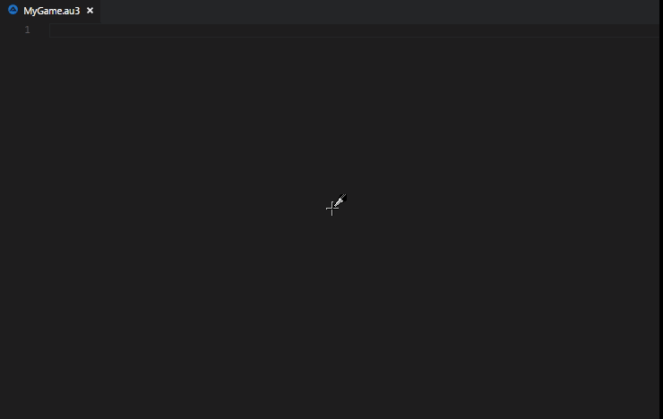
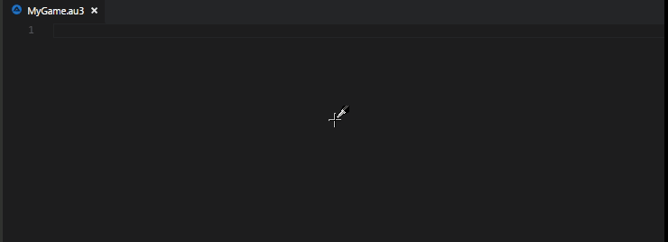

# G-engin Snippets

Visual Studio Code snippets for [UDF](https://www.autoitscript.com/wiki/User_Defined_Functions) [G-Engin](https://github.com/G-Engin/g-engin/blob/g-engine/README.md)

## Features

IntelliSense, code hints and completion

> 
-----------------------------------------------------------------------------------------------------------
> 

## Requirements

* [AutoIt](https://www.autoitscript.com/site/autoit/downloads/)
* [AutoIt Extension Visual Studio Code](https://marketplace.visualstudio.com/items?itemName=Damien.autoit)

<!--## Known Issues

Calling out known issues can help limit users opening duplicate issues against your extension.
-->

## Release Notes

<!-- Users appreciate release notes as you update your extension. -->

### 1.0.0

* Initial release

<!-- -----------------------------------------------------------------------------------------------------------

### For more information

* [Visual Studio Code's Markdown Support](http://code.visualstudio.com/docs/languages/markdown)
* [Markdown Syntax Reference](https://help.github.com/articles/markdown-basics/)

**Enjoy!** -->

### Contributing
Send your Pull Request. :+1:
